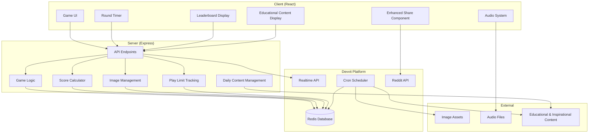

# Design Document

## Overview

AI or Not? is a daily image identification game built on Reddit's Devvit platform. The game challenges players to distinguish between AI-generated and human-captured images across 6 rounds, with each round featuring a 15-second time limit. The system leverages Devvit's Redis capabilities for leaderboards and data persistence, realtime API for live participant counts, scheduler for daily content rotation, and includes educational content, audio feedback, and enhanced social sharing features. Players can attempt the game up to 2 times per day in production mode.

## Architecture

### High-Level Architecture



### Data Flow

1. **Game Initialization**: Client requests daily game data from server, checks play limits
2. **Round Management**: Server provides image pairs with metadata for each of 6 rounds across 6 categories (Animals, Architecture, Nature, Food, Products, Science)
3. **Educational Content**: After round 3, display daily rotating tips and AI facts from config files
4. **Audio Feedback**: Background music and sound effects enhance gameplay experience
5. **Score Tracking**: Real-time score calculation and persistence to Redis
6. **Leaderboard Updates**: Live leaderboard updates via Realtime API
7. **Results Enhancement**: Display inspirational content from config files with final results
8. **Enhanced Sharing**: Share with friends feature and replay tracking
9. **Daily Reset**: Scheduled job resets game state, loads new images and content

## Components and Interfaces

### UI Layout System

#### Responsive Image Layout

The game implements a responsive layout system that adapts to different screen sizes:

**Mobile Layout (< 768px)**:
- Images displayed in vertical stack configuration
- Both images maintain 1:1 aspect ratio
- Full width utilization with consistent spacing
- Touch-optimized interaction areas

**Desktop Layout (≥ 768px)**:
- Images displayed horizontally side-by-side
- Both images maintain 1:1 aspect ratio
- Equal sizing with centered alignment
- Hover states for enhanced interaction feedback

#### Visual Feedback System

**Selection Feedback**:
- Correct selection: Green border (#46E870) with 3px thickness and 30% opacity outer glow
- Incorrect selection: Red border (#F23C3C) with 3px thickness and 30% opacity outer glow
- Rounded corners matching image container styling

**Overlay Indicators**:
- Selected AI image: Red circle (#F23C3C) with white X icon and "AI" label
- Selected Human image: Green circle (#46E870) with white checkmark icon and "Human" label
- Non-selected image: Colored border outline indicating its source type
- No emoji symbols in overlay displays

### Client Components

#### GameContainer

- **Purpose**: Main game orchestrator component
- **State Management**: Game progress, current round, timer state
- **Child Components**: SplashScreen, GameRound, ResultsScreen

#### SplashScreen

- **Purpose**: Welcome screen with participant count
- **Features**: Live participant counter via Realtime API
- **Actions**: Start game button, display current date

#### GameRound

- **Purpose**: Individual round gameplay interface
- **Features**:
  - Responsive image layout: vertical stack on mobile, horizontal side-by-side on desktop
  - All images cropped to 1:1 aspect ratio for consistent presentation
  - 15-second countdown timer with visual progress indicator
  - Image selection handling with enhanced visual and audio feedback
  - Immediate feedback display with custom overlay indicators and border styling

#### EducationalContent

- **Purpose**: Midgame educational display after round 3
- **Features**:
  - Daily rotating tips for identifying AI images
  - Fun facts about AI image generation in accessible language
  - Continue button to proceed to remaining rounds

#### AudioSystem

- **Purpose**: Audio feedback and atmosphere management
- **Features**:
  - Background music during gameplay
  - Click sound effects for image selection
  - Ending sounds based on performance
  - Volume controls and mute options

#### ResultsScreen

- **Purpose**: Post-game results and social sharing
- **Features**:
  - Final score display with updated badge system (6 rounds)
  - Badge presentation with inspirational/humorous content
  - Leaderboard position
  - Enhanced share functionality with "share with friends" option
  - Daily rotating inspirational quotes and humor
  - Play again option (if under daily limit)

#### LeaderboardTabs

- **Purpose**: Multi-view leaderboard interface
- **Features**: Daily, Weekly, All-time tabs with user highlighting

### Server API Endpoints

#### Game Management

```typescript
GET / api / game / init;
POST / api / game / start;
POST / api / game / submit - answer;
GET / api / game / results;
GET / api / game / play - attempts;
POST / api / game / increment - attempts;
```

#### Leaderboard Operations

```typescript
GET / api / leaderboard / daily;
GET / api / leaderboard / weekly;
GET / api / leaderboard / all - time;
GET / api / leaderboard / user - rank;
```

#### Real-time Features

```typescript
GET / api / participants / count;
POST / api / participants / join;
```


#### Administrative

```typescript
POST / internal / scheduler / daily - reset;
POST / internal / on - app - install;
POST / internal / menu / post - create;
```

## Data Models

### Game Session

```typescript
interface GameSession {
  userId: string;
  sessionId: string;
  startTime: number;
  rounds: GameRound[]; // Now contains 6 rounds
  totalScore: number;
  correctCount: number;
  totalTimeBonus: number;
  badge: BadgeType;
  completed: boolean;
  attemptNumber: number; // 1 or 2 for daily limit tracking
  showedEducationalContent: boolean;
}
```

### Game Round

```typescript
interface GameRound {
  roundNumber: number; // 1-6 instead of 1-5
  category: ImageCategory;
  imageA: ImageData;
  imageB: ImageData;
  correctAnswer: 'A' | 'B'; // Randomized placement of human image
  aiImagePosition: 'A' | 'B'; // Which position contains the AI image
  userAnswer?: 'A' | 'B';
  timeRemaining?: number; // Based on 15-second timer
  isCorrect?: boolean;
}
```

### Image Data

```typescript
interface ImageData {
  id: string;
  url: string;
  category: ImageCategory; // Animals, Architecture, Nature, Food, Products, Science
  isAI: boolean;
  metadata: {
    source: string;
    description: string;
  };
}
```

### Leaderboard Entry

```typescript
interface LeaderboardEntry {
  userId: string;
  username: string;
  score: number;
  correctCount: number;
  timeBonus: number;
  completedAt: number;
  badge: BadgeType;
}
```

### Daily Game State

```typescript
interface DailyGameState {
  date: string; // YYYY-MM-DD format
  imageSet: GameRound[]; // Now contains 6 rounds
  participantCount: number;
  categoryOrder: ImageCategory[];
  educationalContent: EducationalContent;
  inspirationalContent: InspirationContent;
}

### Educational Content

```typescript
interface EducationalContent {
  tips: string[];
  facts: string[];
  currentTipIndex: number;
  currentFactIndex: number;
}

### Inspiration Content

```typescript
interface InspirationContent {
  quotes: string[];
  jokes: string[];
  currentIndex: number;
  type: 'quote' | 'joke';
}

### Play Limit Tracking

```typescript
interface UserPlayLimit {
  userId: string;
  date: string;
  attempts: number;
  maxAttempts: number; // 2 in production, unlimited in dev
  bestScore: number;
  bestAttempt: GameSession;
}

### Audio Configuration

```typescript
interface AudioConfig {
  backgroundMusic: string; // File path/URL
  clickSound: string;
  successSound: string;
  failureSound: string;
  enabled: boolean;
  volume: number; // 0-1
}
```

## Error Handling

### Client-Side Error Handling

#### Network Failures

- **Retry Logic**: Automatic retry for failed API calls with exponential backoff
- **Offline Handling**: Cache game state locally, sync when connection restored
- **User Feedback**: Clear error messages with suggested actions

#### Timer Issues

- **Sync Validation**: Server-side validation of client timer submissions (15-second limit)
- **Fallback Mechanism**: Server timeout if client fails to submit within time limit

#### Audio System Failures

- **Graceful Degradation**: Game continues to function if audio fails to load
- **User Controls**: Allow users to disable audio if experiencing issues
- **File Validation**: Validate audio file formats and sizes before loading

### Server-Side Error Handling

#### Redis Failures

- **Connection Resilience**: Automatic reconnection with circuit breaker pattern
- **Data Consistency**: Atomic operations for score updates and leaderboard changes
- **Backup Strategy**: Graceful degradation if Redis is unavailable

#### Image Loading Failures

- **Asset Validation**: Pre-validate all daily images during reset job
- **Placement Randomization**: Ensure AI image placement is properly randomized for each round
- **Fallback Images**: Backup image sets for each category
- **Error Logging**: Comprehensive logging for debugging image issues

#### Content Management Failures

- **Content Fallbacks**: Default educational and inspirational content if files fail to load
- **File Validation**: Validate content file formats and encoding
- **Update Handling**: Graceful handling of content updates during active games

### CSS Implementation Details

#### Responsive Layout Classes

**Mobile-First Approach**:
```css
/* Base mobile layout - vertical stack */
.image-container {
  display: grid;
  grid-template-columns: 1fr;
  gap: 1.5rem;
}

/* Desktop layout - horizontal side-by-side */
@media (min-width: 768px) {
  .image-container {
    grid-template-columns: 1fr 1fr;
  }
}
```

**Image Styling**:
```css
.game-image {
  aspect-ratio: 1 / 1;
  width: 100%;
  object-fit: cover;
  border-radius: 0.5rem;
  transition: all 0.2s ease-in-out;
}
```

#### Visual Feedback Styling

**Border Feedback**:
```css
.correct-border {
  border: 3px solid #46E870;
  box-shadow: 0 0 20px rgba(70, 232, 112, 0.3);
}

.incorrect-border {
  border: 3px solid #F23C3C;
  box-shadow: 0 0 20px rgba(242, 60, 60, 0.3);
}
```

**Overlay Indicators**:
```css
.overlay-indicator {
  position: absolute;
  top: 50%;
  left: 50%;
  transform: translate(-50%, -50%);
  width: 80px;
  height: 80px;
  border-radius: 50%;
  display: flex;
  flex-direction: column;
  align-items: center;
  justify-content: center;
  color: white;
  font-weight: 600;
}

.ai-indicator {
  background-color: #F23C3C;
}

.human-indicator {
  background-color: #46E870;
}
```

### Data Validation

#### Score Integrity

- **Server Validation**: All score calculations performed server-side
- **Timestamp Verification**: Validate round completion times against server clock (15-second limit)
- **Anti-Cheat**: Rate limiting and suspicious activity detection
- **Play Limit Enforcement**: Strict validation of daily attempt limits

#### User Input Validation

- **Answer Validation**: Ensure answers are valid ('A' or 'B')
- **Session Validation**: Verify user respects daily play limits (2 attempts max in production)
- **Timing Validation**: Reject submissions outside valid time windows (15 seconds per round)
- **Content Validation**: Validate educational and inspirational content before display

## Testing Strategy

### Unit Testing

#### Client Components

- **Component Rendering**: Test all UI components render correctly including new educational and audio components
- **Responsive Layout**: Verify mobile vertical stack and desktop horizontal layouts render correctly
- **Image Aspect Ratios**: Test 1:1 aspect ratio maintenance across different screen sizes
- **Visual Feedback**: Test correct/incorrect border styling and overlay indicators
- **State Management**: Verify game state transitions and 15-second timer functionality
- **User Interactions**: Test image selection, navigation flows, and audio controls
- **Educational Content**: Test midgame educational content display after round 3
- **Audio System**: Test audio playback, volume controls, and graceful degradation

#### Server Logic

- **API Endpoints**: Test all endpoint responses and error conditions including new content and play limit endpoints
- **Score Calculation**: Verify accuracy and time bonus calculations for 6-round games
- **Game Logic**: Test round progression, completion detection, and play limit enforcement
- **Content Management**: Test daily content rotation for educational and inspirational content

#### Utility Functions

- **Date Handling**: Test UTC date calculations and timezone handling
- **Image Processing**: Test image metadata parsing and validation
- **Badge Logic**: Test badge assignment based on correct answers (updated for 6 rounds)
- **Content Rotation**: Test daily rotation logic for educational and inspirational content
- **Play Limit Logic**: Test daily attempt tracking and limit enforcement

### Integration Testing

#### Redis Operations

- **Leaderboard Updates**: Test score submission and ranking calculations
- **Daily Reset**: Verify complete state reset and new game initialization
- **Concurrent Access**: Test multiple users playing simultaneously

#### Realtime Features

- **Participant Counting**: Test live participant count updates
- **Connection Handling**: Test realtime connection lifecycle
- **Message Broadcasting**: Verify realtime message delivery

#### Scheduler Integration

- **Cron Execution**: Test daily reset job execution at 00:00 UTC
- **Image Loading**: Test automated image set rotation
- **Error Recovery**: Test scheduler behavior during failures

### End-to-End Testing

#### Complete Game Flow

- **Full Playthrough**: Test complete 6-round game session with educational content after round 3
- **Audio Integration**: Test complete game flow with background music and sound effects
- **Score Persistence**: Verify scores appear correctly on leaderboards
- **Play Limits**: Test multiple attempts per day and limit enforcement
- **Enhanced Sharing**: Test share with friends functionality and updated messages
- **Daily Transition**: Test behavior across daily reset boundary including content rotation

#### Multi-User Scenarios

- **Concurrent Players**: Test multiple users playing simultaneously
- **Leaderboard Competition**: Test ranking updates with multiple scores
- **Share Functionality**: Test social sharing integration

#### Performance Testing

- **Load Testing**: Test system behavior under high concurrent usage
- **Image Loading**: Test image loading performance and caching
- **Database Performance**: Test Redis performance under load

### Accessibility Testing

#### Screen Reader Support

- **Image Alt Text**: Ensure all images have descriptive alt text
- **Navigation**: Test keyboard navigation through all game elements
- **Announcements**: Test screen reader announcements for game state changes

#### Visual Accessibility

- **Color Contrast**: Ensure sufficient contrast for all text and UI elements, including new overlay indicators
- **Color Blind Support**: Test feedback colors (#46E870 green, #F23C3C red) with color blind simulation
- **Font Sizing**: Test readability across different font sizes
- **Focus Indicators**: Clear focus indicators for all interactive elements
- **Responsive Design**: Test accessibility across mobile and desktop layouts

#### Motor Accessibility

- **Touch Targets**: Ensure touch targets meet minimum size requirements
- **Timing**: Provide options for users who need more time (15-second timer consideration)
- **Alternative Inputs**: Support for various input methods
- **Audio Controls**: Accessible audio controls for users with different needs
