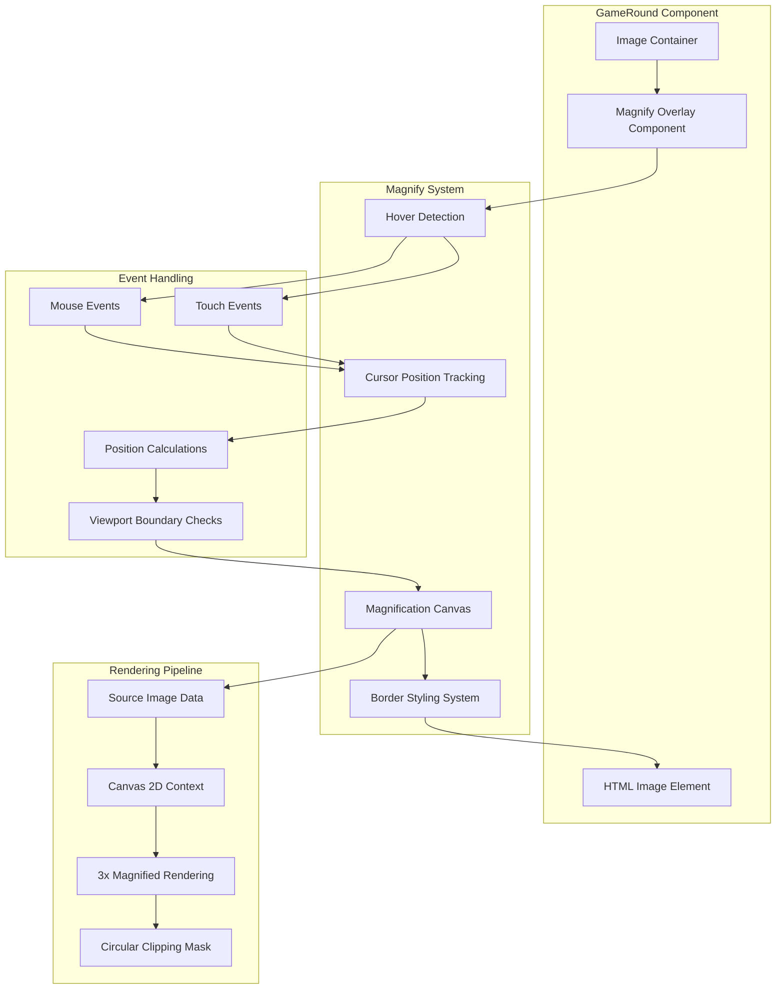

# Design Document

## Overview

The Image Magnify Feature enhances the Spot the Bot game by providing players with a real-time magnification tool during gameplay. When players hover over game images, a circular magnified view appears that follows their cursor, displaying a 3x zoomed portion of the image area. This feature is implemented as a React component that integrates seamlessly with the existing GameRound component, using HTML5 Canvas for high-performance rendering and CSS for responsive styling. The magnification system maintains visual consistency with the game's design language while providing smooth, lag-free interaction across desktop and mobile devices.

## Architecture

### High-Level Architecture



### Component Integration

The magnify feature integrates with the existing GameRound component by:

1. **Wrapping Image Containers**: Each game image is wrapped with a MagnifyContainer component
2. **Event Layer**: A transparent overlay captures mouse/touch events without interfering with click detection
3. **Canvas Rendering**: A positioned canvas element renders the magnified view on demand
4. **State Management**: Hover state and cursor position managed through React hooks

## Components and Interfaces

### Core Components

#### MagnifyContainer

```typescript
interface MagnifyContainerProps {
  children: React.ReactNode;
  imageUrl: string;
  isActive: boolean; // Only active during gameplay, not during feedback
  borderColor: string; // Matches pre-selection border color
  onImageClick?: (event: React.MouseEvent) => void;
}

const MagnifyContainer: React.FC<MagnifyContainerProps> = ({
  children,
  imageUrl,
  isActive,
  borderColor,
  onImageClick
}) => {
  // Component implementation
};
```

#### MagnifyOverlay

```typescript
interface MagnifyOverlayProps {
  imageUrl: string;
  containerRef: React.RefObject<HTMLDivElement>;
  cursorPosition: { x: number; y: number } | null;
  isVisible: boolean;
  borderColor: string;
  magnificationFactor: number; // Always 3
}

const MagnifyOverlay: React.FC<MagnifyOverlayProps> = ({
  imageUrl,
  containerRef,
  cursorPosition,
  isVisible,
  borderColor,
  magnificationFactor = 3
}) => {
  // Canvas-based magnification rendering
};
```

#### useMagnify Hook

```typescript
interface MagnifyState {
  isHovering: boolean;
  cursorPosition: { x: number; y: number } | null;
  isVisible: boolean;
}

interface MagnifyHandlers {
  handleMouseEnter: (event: React.MouseEvent) => void;
  handleMouseMove: (event: React.MouseEvent) => void;
  handleMouseLeave: () => void;
  handleTouchStart: (event: React.TouchEvent) => void;
  handleTouchMove: (event: React.TouchEvent) => void;
  handleTouchEnd: () => void;
}

const useMagnify = (
  containerRef: React.RefObject<HTMLDivElement>,
  isActive: boolean
): [MagnifyState, MagnifyHandlers] => {
  // Hook implementation with state management and event handlers
};
```

### Integration with GameRound

The existing GameRound component will be enhanced to include magnification:

```typescript
// Enhanced GameRound component structure
const GameRound: React.FC<GameRoundProps> = ({ round, onAnswer, timeRemaining }) => {
  const [selectedAnswer, setSelectedAnswer] = useState<'A' | 'B' | null>(null);
  const [showFeedback, setShowFeedback] = useState(false);
  
  // Magnification is only active during gameplay, not during feedback
  const isMagnifyActive = !showFeedback && selectedAnswer === null;
  
  // Get border color from game theme (matches pre-selection state)
  const borderColor = getBorderColor(); // Returns default border color
  
  return (
    <div className="game-round">
      <Timer timeRemaining={timeRemaining} />
      
      <div className="images-container">
        <MagnifyContainer
          imageUrl={round.imageA.url}
          isActive={isMagnifyActive}
          borderColor={borderColor}
          onImageClick={() => handleImageClick('A')}
        >
          
          {showFeedback && <FeedbackOverlay />}
        </MagnifyContainer>
        
        <MagnifyContainer
          imageUrl={round.imageB.url}
          isActive={isMagnifyActive}
          borderColor={borderColor}
          onImageClick={() => handleImageClick('B')}
        >
          
          {showFeedback && <FeedbackOverlay />}
        </MagnifyContainer>
      </div>
    </div>
  );
};
```

## Data Models

### Magnification Configuration

```typescript
interface MagnifyConfig {
  magnificationFactor: number; // Always 3
  circleRadius: number; // Responsive based on screen size
  borderWidth: number; // Matches game design (3px)
  borderColor: string; // Matches pre-selection border
  animationDuration: number; // Fade in/out timing
  performanceMode: 'high' | 'balanced' | 'low'; // Auto-detected based on device
}
```

### Cursor Position Data

```typescript
interface CursorPosition {
  x: number; // Relative to image container
  y: number; // Relative to image container
  clientX: number; // Absolute screen position
  clientY: number; // Absolute screen position
  timestamp: number; // For performance monitoring
}
```

### Viewport Constraints

```typescript
interface ViewportConstraints {
  containerBounds: DOMRect;
  viewportBounds: DOMRect;
  circleRadius: number;
  adjustedPosition: { x: number; y: number };
  isWithinBounds: boolean;
}
```

## Error Handling

### Performance Degradation

**Canvas Rendering Issues**:
- **Fallback Strategy**: Disable magnification if canvas operations fail
- **Performance Monitoring**: Track rendering frame rates and disable if below 30fps
- **Memory Management**: Properly dispose of canvas contexts and image data

**Image Loading Failures**:
- **Graceful Degradation**: Hide magnification if source image fails to load
- **Retry Logic**: Attempt to reload image data once before disabling feature
- **User Feedback**: No error messages - feature simply remains inactive

### Device Compatibility

**Touch Device Handling**:
- **Touch and Hold**: Implement touch and hold gesture for mobile magnification
- **Touch Move**: Track touch movement for cursor following on mobile
- **Gesture Conflicts**: Prevent conflicts with native touch gestures (zoom, scroll)

**Browser Compatibility**:
- **Canvas Support**: Feature detection for HTML5 Canvas support
- **Performance Limits**: Automatic disabling on low-performance devices
- **Fallback Behavior**: Game remains fully functional without magnification

### Edge Cases

**Rapid Cursor Movement**:
- **Debouncing**: Limit update frequency to maintain performance
- **Smooth Interpolation**: Use requestAnimationFrame for smooth cursor following
- **Memory Leaks**: Proper cleanup of event listeners and canvas contexts

**Viewport Boundaries**:
- **Edge Detection**: Keep magnified circle fully visible within viewport
- **Position Adjustment**: Automatically adjust circle position near edges
- **Responsive Behavior**: Handle orientation changes and window resizing

## Testing Strategy

### Unit Testing

#### Component Testing

**MagnifyContainer Component**:
- Test hover state activation and deactivation
- Verify click events pass through correctly
- Test border color application
- Verify active/inactive state handling

**MagnifyOverlay Component**:
- Test canvas rendering with different image sources
- Verify 3x magnification accuracy
- Test circular clipping mask application
- Verify border styling consistency

**useMagnify Hook**:
- Test cursor position tracking accuracy
- Verify event handler registration and cleanup
- Test state transitions (hover enter/leave)
- Verify touch event handling on mobile

#### Rendering Tests

**Canvas Operations**:
- Test image drawing at 3x magnification
- Verify circular clipping mask accuracy
- Test performance with different image sizes
- Verify memory cleanup after rendering

**Position Calculations**:
- Test cursor position relative to image container
- Verify viewport boundary detection
- Test position adjustment near edges
- Verify responsive circle sizing

### Integration Testing

#### GameRound Integration

**Component Integration**:
- Test magnification with existing GameRound component
- Verify click detection works with magnification overlay
- Test timer functionality with magnification active
- Verify feedback display disables magnification

**State Management**:
- Test magnification state during round transitions
- Verify proper cleanup between rounds
- Test interaction with game state changes
- Verify performance impact on overall game

#### Cross-Device Testing

**Desktop Browsers**:
- Test mouse hover interactions
- Verify cursor following accuracy
- Test performance across different browsers
- Verify visual consistency

**Mobile Devices**:
- Test touch and hold gesture activation
- Verify touch move cursor following
- Test performance on various mobile devices
- Verify responsive circle sizing

### Performance Testing

#### Rendering Performance

**Frame Rate Testing**:
- Monitor canvas rendering frame rates
- Test with various image sizes and qualities
- Verify 60fps target maintenance
- Test performance degradation thresholds

**Memory Usage**:
- Monitor memory consumption during magnification
- Test for memory leaks with extended use
- Verify proper cleanup of canvas contexts
- Test garbage collection efficiency

#### User Experience Testing

**Responsiveness**:
- Test cursor following lag (target <16ms)
- Verify smooth fade in/out animations
- Test rapid cursor movement handling
- Verify no impact on click responsiveness

**Visual Quality**:
- Test magnification quality at 3x zoom
- Verify border styling consistency
- Test circular mask edge smoothness
- Verify color accuracy preservation

### Accessibility Testing

#### Screen Reader Support

**Alternative Access**:
- Provide keyboard shortcuts for magnification activation
- Ensure screen readers can describe magnification state
- Test with various assistive technologies
- Verify no interference with existing accessibility features

#### Motor Accessibility

**Alternative Interactions**:
- Support keyboard-based magnification control
- Provide adjustable hover timing for motor difficulties
- Test with various input devices
- Ensure magnification doesn't interfere with accessibility tools

#### Visual Accessibility

**High Contrast Support**:
- Test magnification with high contrast themes
- Verify border visibility in various color schemes
- Test with color blind simulation
- Ensure magnification works with zoom accessibility features

## Implementation Details

### Canvas Rendering Pipeline

#### Image Processing

```typescript
const renderMagnifiedView = (
  canvas: HTMLCanvasElement,
  sourceImage: HTMLImageElement,
  cursorPosition: { x: number; y: number },
  magnificationFactor: number,
  circleRadius: number
) => {
  const ctx = canvas.getContext('2d');
  if (!ctx) return;

  // Clear canvas
  ctx.clearRect(0, 0, canvas.width, canvas.height);

  // Create circular clipping path
  ctx.beginPath();
  ctx.arc(circleRadius, circleRadius, circleRadius, 0, 2 * Math.PI);
  ctx.clip();

  // Calculate source area to magnify
  const sourceSize = circleRadius / magnificationFactor;
  const sourceX = cursorPosition.x - sourceSize;
  const sourceY = cursorPosition.y - sourceSize;

  // Draw magnified portion
  ctx.drawImage(
    sourceImage,
    sourceX, sourceY, sourceSize * 2, sourceSize * 2, // source rectangle
    0, 0, circleRadius * 2, circleRadius * 2 // destination rectangle
  );
};
```

#### Border Styling

```css
.magnify-circle {
  position: absolute;
  border-radius: 50%;
  border: 3px solid var(--border-color);
  pointer-events: none;
  z-index: 10;
  transition: opacity 0.15s ease-in-out;
}

.magnify-circle.visible {
  opacity: 1;
}

.magnify-circle.hidden {
  opacity: 0;
}
```

### Responsive Design

#### Circle Sizing

```typescript
const getResponsiveCircleRadius = (containerWidth: number): number => {
  // Base radius as percentage of container width
  const baseRadius = Math.min(containerWidth * 0.15, 80); // Max 80px, min 15% of width
  
  // Adjust for mobile devices
  if (window.innerWidth < 768) {
    return Math.max(baseRadius * 1.2, 60); // Larger on mobile, min 60px
  }
  
  return Math.max(baseRadius, 50); // Min 50px on desktop
};
```

#### Touch Gesture Handling

```typescript
const handleTouchInteraction = (
  event: TouchEvent,
  containerRef: React.RefObject<HTMLDivElement>
) => {
  event.preventDefault(); // Prevent native gestures
  
  const touch = event.touches[0];
  if (!touch || !containerRef.current) return;
  
  const rect = containerRef.current.getBoundingClientRect();
  const position = {
    x: touch.clientX - rect.left,
    y: touch.clientY - rect.top
  };
  
  return position;
};
```

### Performance Optimization

#### Rendering Throttling

```typescript
const useThrottledMagnify = (
  updateFunction: (position: { x: number; y: number }) => void,
  delay: number = 16 // ~60fps
) => {
  const lastUpdate = useRef(0);
  
  return useCallback((position: { x: number; y: number }) => {
    const now = Date.now();
    if (now - lastUpdate.current >= delay) {
      updateFunction(position);
      lastUpdate.current = now;
    }
  }, [updateFunction, delay]);
};
```

#### Memory Management

```typescript
const useCanvasCleanup = (canvasRef: React.RefObject<HTMLCanvasElement>) => {
  useEffect(() => {
    return () => {
      // Cleanup canvas context on unmount
      const canvas = canvasRef.current;
      if (canvas) {
        const ctx = canvas.getContext('2d');
        if (ctx) {
          ctx.clearRect(0, 0, canvas.width, canvas.height);
        }
      }
    };
  }, []);
};
```
