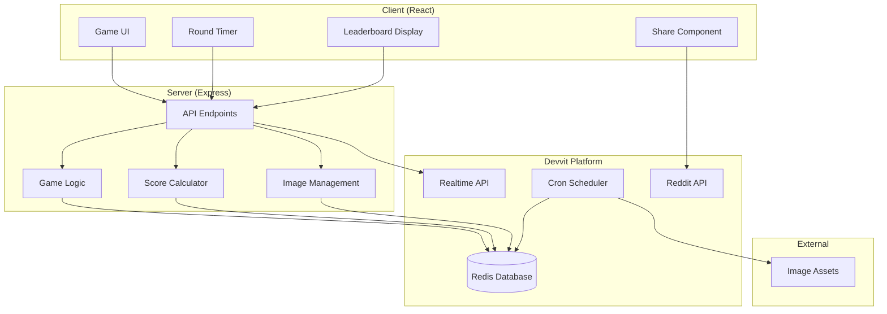

# Design Document

## Overview

Spot the Bot is a daily image identification game built on Reddit's Devvit platform. The game challenges players to distinguish between AI-generated and human-captured images across 5 rounds, with each round featuring a 10-second time limit. The system leverages Devvit's Redis capabilities for leaderboards and data persistence, realtime API for live participant counts, and scheduler for daily content rotation.

## Architecture

### High-Level Architecture



### Data Flow

1. **Game Initialization**: Client requests daily game data from server
2. **Round Management**: Server provides image pairs with metadata for each round
3. **Score Tracking**: Real-time score calculation and persistence to Redis
4. **Leaderboard Updates**: Live leaderboard updates via Realtime API
5. **Daily Reset**: Scheduled job resets game state and loads new images

## Components and Interfaces

### Client Components

#### GameContainer

- **Purpose**: Main game orchestrator component
- **State Management**: Game progress, current round, timer state
- **Child Components**: SplashScreen, GameRound, ResultsScreen

#### SplashScreen

- **Purpose**: Welcome screen with participant count
- **Features**: Live participant counter via Realtime API
- **Actions**: Start game button, display current date

#### GameRound

- **Purpose**: Individual round gameplay interface
- **Features**:
  - Side-by-side image display with randomized AI placement
  - 10-second countdown timer
  - Image selection handling
  - Immediate feedback display highlighting the AI image

#### ResultsScreen

- **Purpose**: Post-game results and social sharing
- **Features**:
  - Final score display
  - Badge presentation
  - Leaderboard position
  - Share functionality with clipboard integration

#### LeaderboardTabs

- **Purpose**: Multi-view leaderboard interface
- **Features**: Daily, Weekly, All-time tabs with user highlighting

### Server API Endpoints

#### Game Management

```typescript
GET / api / game / init;
POST / api / game / start;
POST / api / game / submit - answer;
GET / api / game / results;
```

#### Leaderboard Operations

```typescript
GET / api / leaderboard / daily;
GET / api / leaderboard / weekly;
GET / api / leaderboard / all - time;
GET / api / leaderboard / user - rank;
```

#### Real-time Features

```typescript
GET / api / participants / count;
POST / api / participants / join;
```

#### Administrative

```typescript
POST / internal / scheduler / daily - reset;
POST / internal / on - app - install;
POST / internal / menu / post - create;
```

## Data Models

### Game Session

```typescript
interface GameSession {
  userId: string;
  sessionId: string;
  startTime: number;
  rounds: GameRound[];
  totalScore: number;
  correctCount: number;
  totalTimeBonus: number;
  badge: BadgeType;
  completed: boolean;
}
```

### Game Round

```typescript
interface GameRound {
  roundNumber: number;
  category: ImageCategory;
  imageA: ImageData;
  imageB: ImageData;
  correctAnswer: 'A' | 'B'; // Randomized placement of human image
  aiImagePosition: 'A' | 'B'; // Which position contains the AI image
  userAnswer?: 'A' | 'B';
  timeRemaining?: number;
  isCorrect?: boolean;
}
```

### Image Data

```typescript
interface ImageData {
  id: string;
  url: string;
  category: ImageCategory;
  isAI: boolean;
  metadata: {
    source: string;
    description: string;
  };
}
```

### Leaderboard Entry

```typescript
interface LeaderboardEntry {
  userId: string;
  username: string;
  score: number;
  correctCount: number;
  timeBonus: number;
  completedAt: number;
  badge: BadgeType;
}
```

### Daily Game State

```typescript
interface DailyGameState {
  date: string; // YYYY-MM-DD format
  imageSet: GameRound[];
  participantCount: number;
  categoryOrder: ImageCategory[];
}
```

## Error Handling

### Client-Side Error Handling

#### Network Failures

- **Retry Logic**: Automatic retry for failed API calls with exponential backoff
- **Offline Handling**: Cache game state locally, sync when connection restored
- **User Feedback**: Clear error messages with suggested actions

#### Timer Issues

- **Sync Validation**: Server-side validation of client timer submissions
- **Fallback Mechanism**: Server timeout if client fails to submit within time limit

### Server-Side Error Handling

#### Redis Failures

- **Connection Resilience**: Automatic reconnection with circuit breaker pattern
- **Data Consistency**: Atomic operations for score updates and leaderboard changes
- **Backup Strategy**: Graceful degradation if Redis is unavailable

#### Image Loading Failures

- **Asset Validation**: Pre-validate all daily images during reset job
- **Placement Randomization**: Ensure AI image placement is properly randomized for each round
- **Fallback Images**: Backup image sets for each category
- **Error Logging**: Comprehensive logging for debugging image issues

### Data Validation

#### Score Integrity

- **Server Validation**: All score calculations performed server-side
- **Timestamp Verification**: Validate round completion times against server clock
- **Anti-Cheat**: Rate limiting and suspicious activity detection

#### User Input Validation

- **Answer Validation**: Ensure answers are valid ('A' or 'B')
- **Session Validation**: Verify user can only play once per day
- **Timing Validation**: Reject submissions outside valid time windows

## Testing Strategy

### Unit Testing

#### Client Components

- **Component Rendering**: Test all UI components render correctly
- **State Management**: Verify game state transitions and timer functionality
- **User Interactions**: Test image selection and navigation flows

#### Server Logic

- **API Endpoints**: Test all endpoint responses and error conditions
- **Score Calculation**: Verify accuracy and time bonus calculations
- **Game Logic**: Test round progression and completion detection

#### Utility Functions

- **Date Handling**: Test UTC date calculations and timezone handling
- **Image Processing**: Test image metadata parsing and validation
- **Badge Logic**: Test badge assignment based on correct answers

### Integration Testing

#### Redis Operations

- **Leaderboard Updates**: Test score submission and ranking calculations
- **Daily Reset**: Verify complete state reset and new game initialization
- **Concurrent Access**: Test multiple users playing simultaneously

#### Realtime Features

- **Participant Counting**: Test live participant count updates
- **Connection Handling**: Test realtime connection lifecycle
- **Message Broadcasting**: Verify realtime message delivery

#### Scheduler Integration

- **Cron Execution**: Test daily reset job execution at 00:00 UTC
- **Image Loading**: Test automated image set rotation
- **Error Recovery**: Test scheduler behavior during failures

### End-to-End Testing

#### Complete Game Flow

- **Full Playthrough**: Test complete 5-round game session
- **Score Persistence**: Verify scores appear correctly on leaderboards
- **Daily Transition**: Test behavior across daily reset boundary

#### Multi-User Scenarios

- **Concurrent Players**: Test multiple users playing simultaneously
- **Leaderboard Competition**: Test ranking updates with multiple scores
- **Share Functionality**: Test social sharing integration

#### Performance Testing

- **Load Testing**: Test system behavior under high concurrent usage
- **Image Loading**: Test image loading performance and caching
- **Database Performance**: Test Redis performance under load

### Accessibility Testing

#### Screen Reader Support

- **Image Alt Text**: Ensure all images have descriptive alt text
- **Navigation**: Test keyboard navigation through all game elements
- **Announcements**: Test screen reader announcements for game state changes

#### Visual Accessibility

- **Color Contrast**: Ensure sufficient contrast for all text and UI elements
- **Font Sizing**: Test readability across different font sizes
- **Focus Indicators**: Clear focus indicators for all interactive elements

#### Motor Accessibility

- **Touch Targets**: Ensure touch targets meet minimum size requirements
- **Timing**: Provide options for users who need more time
- **Alternative Inputs**: Support for various input methods
